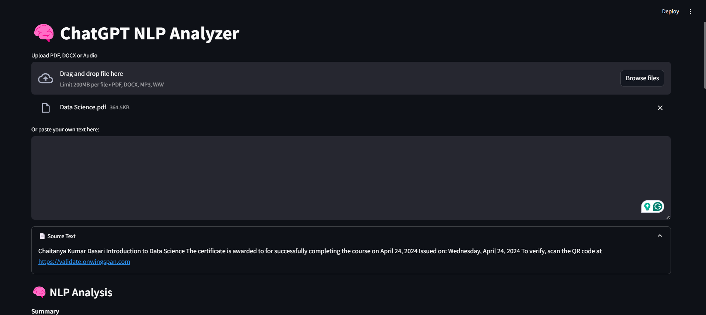

# 🧠 ChatGPT NLP Analyzer

A Streamlit-powered app that uses the OpenAI ChatGPT API to analyze and summarize PDF/text content. Upload documents, extract summaries and keywords, analyze sentiment, and ask questions conversationally — all powered by AI!


## 🔍 Features
- 📄 Upload PDF, DOCX or Audio
- 🧠 ChatGPT-powered summarization
- 📝 Keyword extraction & sentiment analysis
- 💬 Chat with your document
- 📥 Export results

## 🚀 Install & Run
```bash
git clone https://github.com/yourusername/chatgpt-nlp-analyzer.git
cd chatgpt-nlp-analyzer
python -m venv venv
source venv/bin/activate #This is Linux command for windows use windows command
pip install -r requirements.txt
cp .env.example .env  # or else Create a .env file at the root of your project:
# Add your OpenAI key
streamlit run app/app.py
```

## 📦 Tech Stack
- Streamlit
- OpenAI GPT
- Whisper
- PyMuPDF
- python-docx
- dotenv

  
## 🔐 Setting Up Your OpenAI API Key

To use this app, you need to set your OpenAI API key. Follow the steps below:

### 1. **Get Your API Key**

- Visit [OpenAI Dashboard](https://platform.openai.com/account/api-keys)
- Click **Create new secret key**
- Copy the key (starts with `sk-...`)

---

### 2. **Create a `.env` File**

At the root of the project, create a file named `.env` (if it doesn't already exist), and add the following line:

```bash
OPENAI_API_KEY=your-api-key-here
```


### 🙌 Author
Built with ❤️ by [Chaitanya Kumar Dasari](https://github.com/chaitanyakumar-d)
